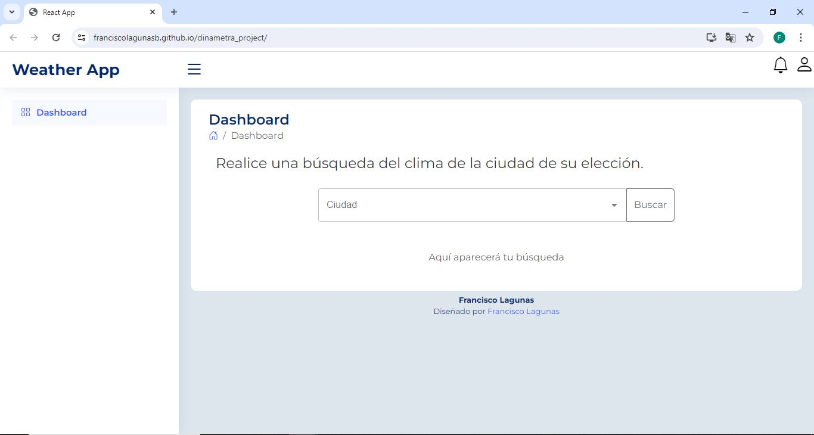
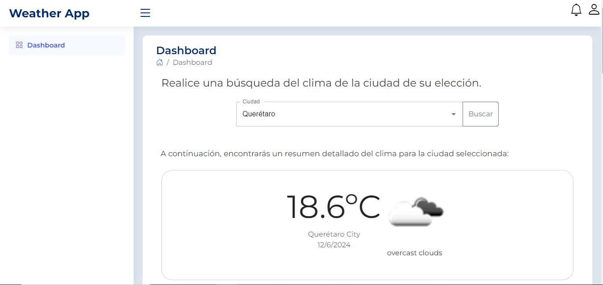
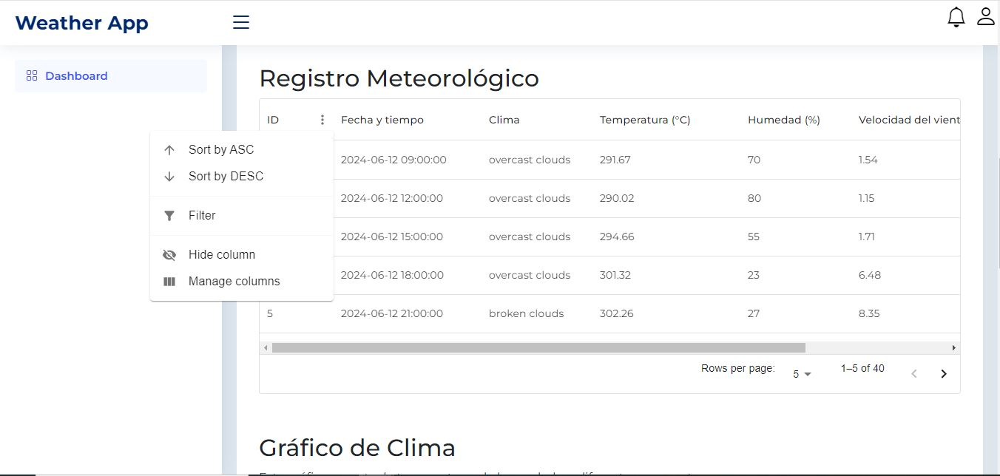
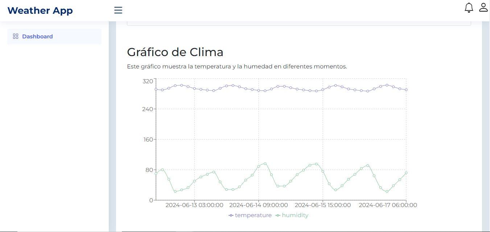
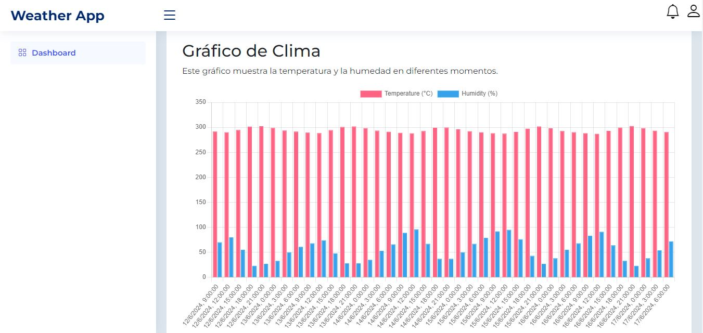
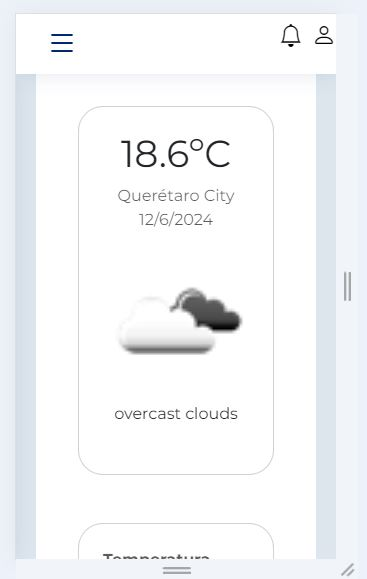
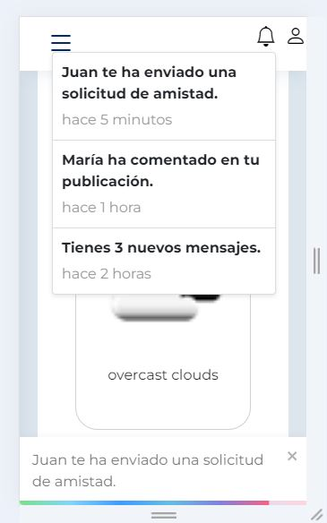

# Dashboard Interactivo

Este proyecto es un dashboard interactivo que visualiza datos de [API de tu elección]. Utiliza React en su versión más reciente (18), lo que ha causado conflictos con algunas bibliotecas que aún no han sido actualizadas.

## Tecnologías Utilizadas

- React v18
- Material-UI
- Bootstrap
- Chart.js y Recharts para la visualización de datos
- Uso de tooltips y alertas

## Configuración y Ejecución

1. Clona este repositorio.
2. Instala las dependencias utilizando npm:

```
npm install
```

3. Ejecuta la aplicación:

```
npm run start
```

La aplicación estará disponible en localhost:3000.

4. Enfoque Adoptado
El sistema está dividido en componentes para mantener una estructura modular y fácil de mantener. Se ha prestado especial atención a la responsividad, utilizando las bibliotecas Material-UI y Bootstrap para garantizar una experiencia de usuario coherente en diferentes dispositivos.


A continuación se muestran capturas de pantalla del dashboard en diferentes estados:

Estado inicial de la aplicación


Busqueda de información


Resultado


Tabla de información de registros con historial de la aplicación


Uso de librería recharts para mostrar historico de los registros


Uso de librería charts.js para mostrar historico de los registros


Vista responsive


Notificaciones de la aplicación


##Nota
Los filtros de la tabla generan modificaciones en tiempo real con la graficación de la información.